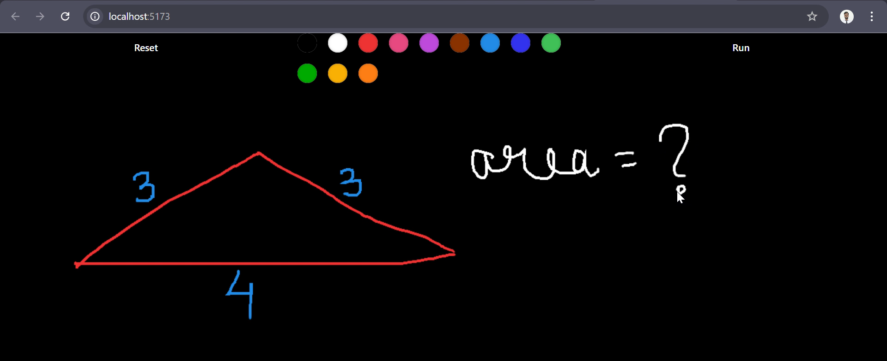
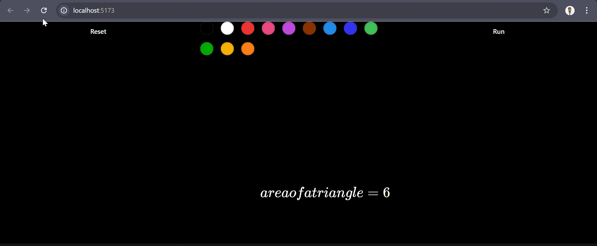
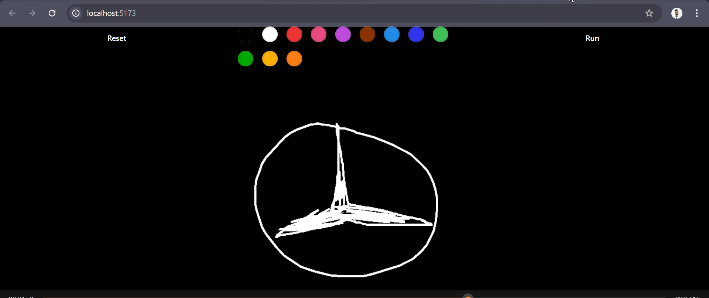
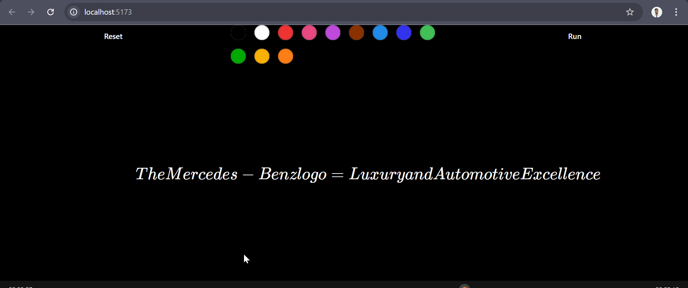

# ✍️ Gen-AI Calculator 🧮
## 📄 Overview
Welcome to the Gen-AI Calculator! 🚀 This innovative AI-powered web application works similarly to the calculator app on the new iPad but with advanced intelligence! 🧠✨ Whether you scribble or draw math equations, expressions, or even random images, this AI calculator is smart enough to interpret them and provide accurate solutions or detailed descriptions. 💡

Built using a Node.js frontend, Python backend, and powered by Google Gemini Pro API, this web app brings a fun, interactive, and intelligent problem-solving experience to your fingertips. ✏️

## Video Demonstration
  Here is the link for the video demonstration and real-time working of the generative-ai calculator.

  
https://drive.google.com/file/d/16nDcillfXymb2kcEWFwUGMpaIDHR0KXE/view?usp=sharing


## 🔑 Key Features
- Scribble & Solve ✍️: Handwrite any mathematical equation or expression, and the AI will solve it for you in real-time.
- Image Recognition 🎨: Draw an image, and the model will interpret and describe it.
- Real-time Math Rendering 🧮: Using MathJax and LaTeX, your math equations are rendered beautifully and instantly on the screen.
- AI-Powered 🤖: Based on the powerful Google Gemini Pro API, ensuring accurate and intelligent responses to both math and image inputs.
## 🚀 Getting Started
  Follow the steps below to set up and run the Gen-AI Calculator on your local machine:

1. Clone the Repository
2. Install Dependencies
   - Frontend (Node.js):
```
npm install
```
   - Backend (Python):
```
pip install -r requirements.txt
```
3. Set Up Google Gemini Pro API
    Ensure you have access to the Google Gemini Pro API. Generate a new Gemini API Key from Google AI Studio and paste it inside the .env file in the frontend folder of the project.
4. Run the Application
   - Start the server (Backend):
     ```
     cd ai_calc_backend
     python main.py
     ```
   - Run the frontend:
     ```
     cd ..
     cd ai_calc_frontend
     npm run dev
     ```
## 🎨 Tech Stack
1. Frontend:
- Node.js 🌐: Core for the web interface.
- Tailwind CSS 💅: For styling the web interface.
- PostCSS 📦: CSS processing and optimization.
2. Backend:
- Python 🐍: To handle the server-side logic and API requests.
- Google Gemini Pro API 🧠: Powers the AI-driven features.
- MathJax & LaTeX 🧮: For rendering math expressions in real-time.
3. Libraries:
- shadcn 🌈: For UI components.
- Pydantic 📦: Ensures data validation and proper handling of API responses.
- Google Generative AI 🤖: Core generative AI used for interpreting scribbled input.
## 📊 Features Breakdown
- Math Equation Solver: Easily write or draw math problems, and let the AI compute the result for you.
- Image Recognition: Draw shapes or images, and the model will describe your input.
- Real-Time Rendering: Math expressions are instantly and beautifully rendered using MathJax and LaTeX.
- Responsive Interface: Built with Tailwind CSS, ensuring a smooth and flexible design across devices.
## 🔧 How It Works
- Frontend: Users scribble or draw math equations, expressions, or images using the web interface built with Node.js, Tailwind CSS, and PostCSS.
- Backend: The Python backend processes the inputs using the Google Gemini Pro API to interpret the scribbles and return either a math solution or an image description.
- Result Display: Math expressions are rendered beautifully using MathJax and LaTeX for easy readability.
## 📸 Screenshots











